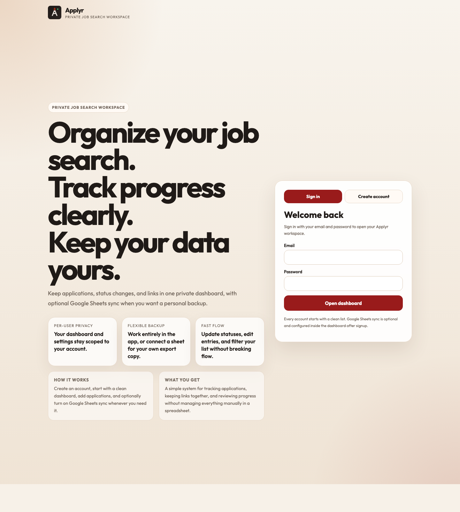
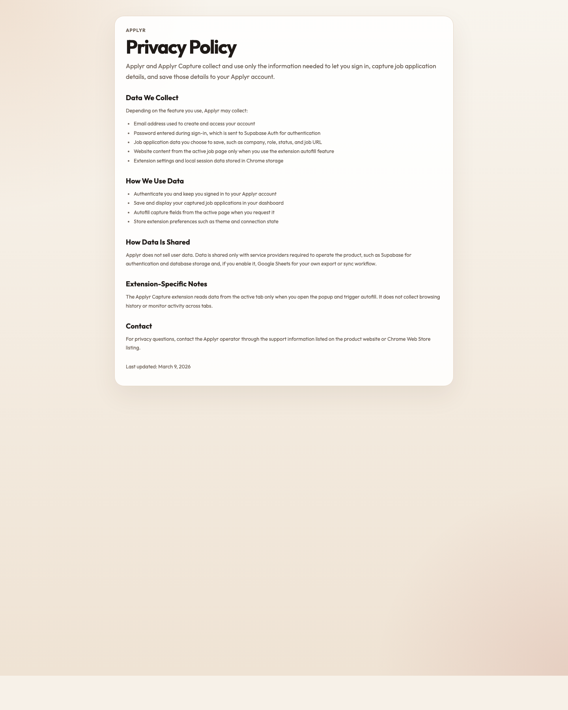

# Applyr

Applyr is a private job search workspace built with Next.js, Supabase, and an optional Google Sheets sync layer. The public site lives at [useapplyr.vercel.app](https://useapplyr.vercel.app/) and exposes a branded landing page, account creation and sign-in flow, plus a public privacy page for the web app and Chrome extension.

## Live Site

- Landing page: [https://useapplyr.vercel.app/](https://useapplyr.vercel.app/)
- Privacy policy: [https://useapplyr.vercel.app/privacy](https://useapplyr.vercel.app/privacy)

### Screenshots

Landing page captured from production on March 9, 2026:



Privacy page captured from production on March 9, 2026:



## What The Product Includes

### Public web experience

- A branded landing page with `Sign in` and `Create account` modes.
- Supabase email/password authentication.
- A public privacy policy page for Applyr and Applyr Capture.

### Authenticated dashboard

- Per-user application tracking backed by Supabase.
- Create, edit, delete, and inline status updates for applications.
- Search, status filters, sorting, pagination, and quick stats.
- Light and dark theme toggle stored in local browser storage.
- Keyboard shortcut: press `n` to open the new application modal.

### Google Sheets sync

- Optional per-user sheet connection.
- Configurable spreadsheet ID and sheet tab.
- Automatic sync on create, update, and delete when enabled.
- Full-sheet rebuild via `Sync all`.
- Sheet row mapping persisted in the database so edits can target the correct row later.

### Chrome extension

- Source lives in `extensions/job-capture`.
- Popup-based sign-in using the same Supabase project as the web app.
- Autofill from the active job page when the user requests it.
- Manual capture form for company, title, status, and job URL.
- Local session persistence inside Chrome storage.
- Unpacked builds can point at a custom app URL; store builds are locked to `https://useapplyr.vercel.app`.

## Tech Stack

- Next.js 16 App Router
- React 19
- Supabase Auth + database
- Google Sheets API via service account
- Chrome Extension Manifest V3

## Repo Map

- `app/`: Next.js routes, public pages, dashboard UI, and API endpoints.
- `app/components/`: Landing page and authenticated dashboard client components.
- `app/api/applications/`: Create and list application records.
- `app/api/applications/[id]/`: Update and delete a single application.
- `app/api/user-settings/`: Persist per-user Google Sheets settings.
- `app/api/user-settings/sync/`: Rebuild a user's sheet from the database.
- `app/api/extension/config/`: Exposes app base URL and Supabase public config to the extension.
- `app/api/health/`: Simple health check endpoint.
- `extensions/job-capture/`: Chrome extension popup, manifest, icons, and capture logic.
- `lib/`: Supabase auth helpers, env parsing, Sheets integration, validation, and user settings helpers.
- `supabase/migrations/`: Database schema and multi-user migration history.
- `public/`: static assets, including the README screenshots in this repo.
- `applyr-capture.zip`: packaged extension artifact currently committed in the repo.

## Data Model

Applications track:

- `company`
- `job_title`
- `status`
- `job_url`
- `applied_at`
- `updated_at`
- `sheet_row_number`
- `user_id`
- `request_id` for idempotent creates

Supported statuses:

- `Applied`
- `Reject`
- `Accepted`
- `Interview`
- `OA`

User settings track:

- `google_sheet_id`
- `google_sheet_tab`
- `google_sheet_sync_enabled`
- `user_id`

## Environment Variables

Copy `.env.example` to `.env.local` and fill in:

```bash
cp .env.example .env.local
```

Required:

- `NEXT_PUBLIC_APP_URL`
- `NEXT_PUBLIC_SUPABASE_URL`
- `NEXT_PUBLIC_SUPABASE_ANON_KEY`
- `SUPABASE_URL`
- `SUPABASE_SERVICE_ROLE_KEY`

Optional:

- `GOOGLE_SERVICE_ACCOUNT_JSON`
- `GOOGLE_SHEET_TAB`

`GOOGLE_SERVICE_ACCOUNT_JSON` must be valid JSON. If it is omitted, the dashboard stays fully usable but Google Sheets sync is unavailable.

## Database Setup

Run these migrations in order in the Supabase SQL editor:

1. `supabase/migrations/20260305_create_applications.sql`
2. `supabase/migrations/20260306_update_application_statuses.sql`
3. `supabase/migrations/20260309_multi_user_auth_and_settings.sql`

The multi-user migration backfills legacy rows to the earliest auth user in the project.

## Local Development

Install dependencies:

```bash
npm install
```

Start the app:

```bash
npm run dev
```

Open [http://localhost:3000](http://localhost:3000).

Useful checks:

```bash
npm run lint
npm run typecheck
```

## API Surface

Authenticated routes expect a Supabase bearer token in the `Authorization` header.

- `GET /api/health`: health probe with an `ok` flag and timestamp.
- `GET /api/extension/config`: public extension bootstrap config.
- `GET /api/applications`: list the signed-in user's applications.
- `POST /api/applications`: create a new application. Supports `x-idempotency-key`.
- `PATCH /api/applications/:id`: update one application.
- `DELETE /api/applications/:id`: delete one application and remove it from the connected sheet when applicable.
- `GET /api/user-settings`: fetch per-user Google Sheets settings.
- `PATCH /api/user-settings`: save per-user Google Sheets settings.
- `POST /api/user-settings/sync`: rebuild the connected sheet from current database records.

## Google Sheets Sync Notes

To enable sync:

1. Set `GOOGLE_SERVICE_ACCOUNT_JSON` on the server.
2. Sign in to Applyr.
3. Open `Google Sheets Sync` in the dashboard.
4. Paste your spreadsheet ID.
5. Share the sheet with the service account email shown in the UI.
6. Enable sync or run `Sync all`.

The sheet columns written by the app are:

1. `application_id`
2. `applied_at`
3. `company`
4. `job_title`
5. `status`
6. `job_url`
7. `updated_at`

## Chrome Extension

The extension in `extensions/job-capture` is designed to talk to the same deployed or local Applyr app.

For local testing:

1. Load `extensions/job-capture` as an unpacked extension in Chrome.
2. Open the popup and set `API Base URL` if you are not using production.
3. Sign in with the same account you use in the dashboard.
4. Autofill from a job page or enter details manually.
5. Save the application to the dashboard.

The popup stores its own Supabase session and reuses the same protected API routes as the web app.

## Deployment

Vercel deployment steps are documented in [DEPLOYMENT.md](./DEPLOYMENT.md).

Production currently assumes:

- web app hosted on `https://useapplyr.vercel.app`
- Supabase configured for browser auth and server-side admin access
- optional Google service account for Sheets sync

## License

[MIT](./LICENSE)
